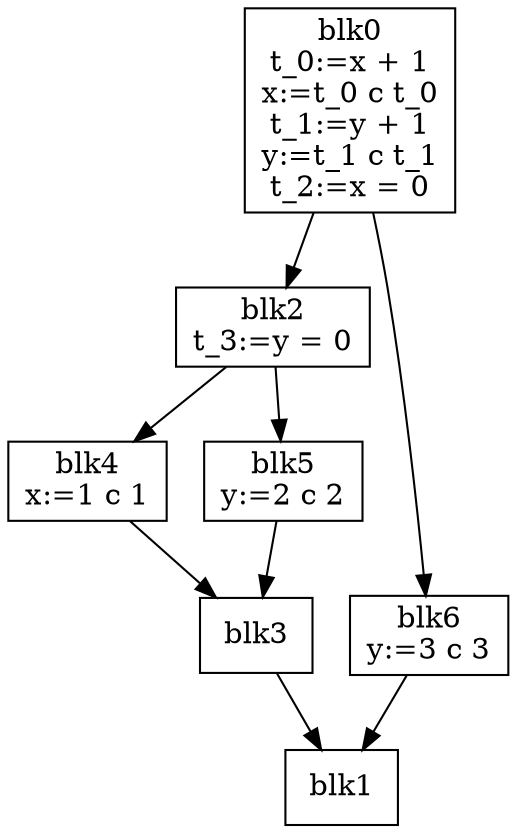

```graphviz
digraph {
node [shape=box];
BB0x55b7d1125aa0 [label="blk0
t_0:=x + 1
x:=t_0 c t_0
t_1:=y + 1
y:=t_1 c t_1
t_2:=x = 0
"];
BB0x55b7d1125aa0 -> BB0x55b7d1125dc0
BB0x55b7d1125aa0 -> BB0x55b7d1126080
BB0x55b7d1125dc0 [label="blk2
t_3:=y = 0
"];
BB0x55b7d1125dc0 -> BB0x55b7d1125ee0
BB0x55b7d1125dc0 -> BB0x55b7d1125fb0
BB0x55b7d1125ee0 [label="blk4
x:=1 c 1
"];
BB0x55b7d1125ee0 -> BB0x55b7d1125e90
BB0x55b7d1125e90 [label="blk3
"];
BB0x55b7d1125e90 -> BB0x55b7d1125d70
BB0x55b7d1125d70 [label="blk1
"];
BB0x55b7d1125fb0 [label="blk5
y:=2 c 2
"];
BB0x55b7d1125fb0 -> BB0x55b7d1125e90
BB0x55b7d1126080 [label="blk6
y:=3 c 3
"];
BB0x55b7d1126080 -> BB0x55b7d1125d70
}
```