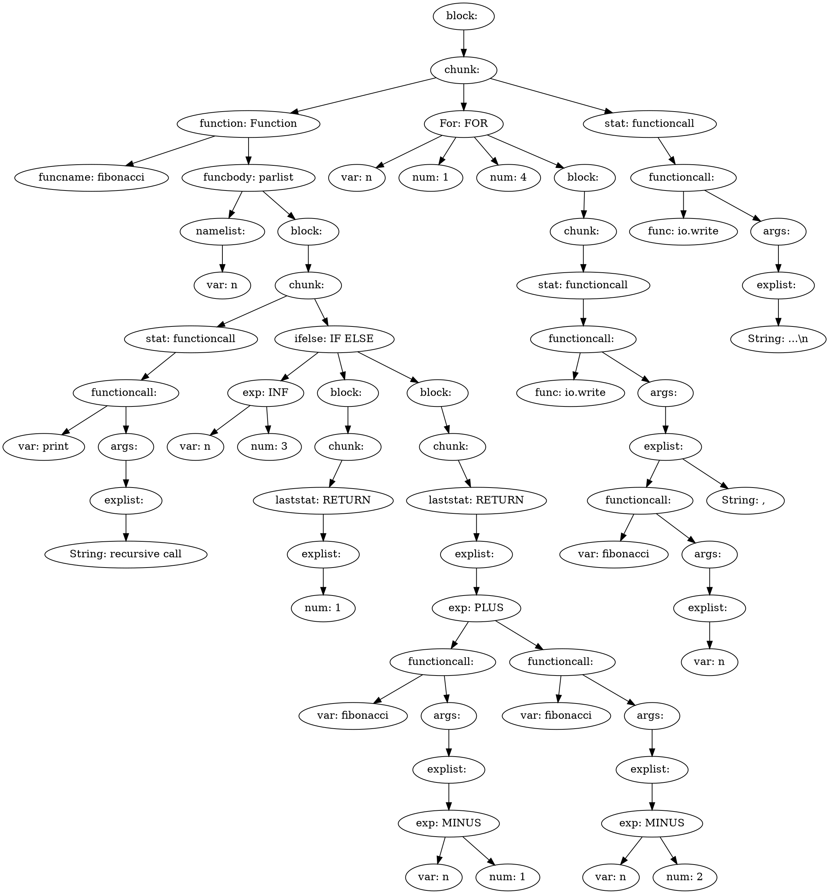

```graphviz
digraph {
67 [label="block: "];
67 -> 41
41 [label="chunk: "];
41 -> 40
41 -> 59
41 -> 66
40 [label="function: Function"];
40 -> 0
40 -> 39
0 [label="funcname: fibonacci"];
39 [label="funcbody: parlist"];
39 -> 1
39 -> 38
1 [label="namelist: "];
1 -> 2
2 [label="var: n"];
38 [label="block: "];
38 -> 9
9 [label="chunk: "];
9 -> 8
9 -> 37
8 [label="stat: functioncall"];
8 -> 7
7 [label="functioncall: "];
7 -> 3
7 -> 6
3 [label="var: print"];
6 [label="args: "];
6 -> 5
5 [label="explist: "];
5 -> 4
4 [label="String: recursive call"];
37 [label="ifelse: IF ELSE"];
37 -> 12
37 -> 17
37 -> 36
12 [label="exp: INF"];
12 -> 10
12 -> 11
10 [label="var: n"];
11 [label="num: 3"];
17 [label="block: "];
17 -> 16
16 [label="chunk: "];
16 -> 15
15 [label="laststat: RETURN"];
15 -> 14
14 [label="explist: "];
14 -> 13
13 [label="num: 1"];
36 [label="block: "];
36 -> 35
35 [label="chunk: "];
35 -> 34
34 [label="laststat: RETURN"];
34 -> 33
33 [label="explist: "];
33 -> 32
32 [label="exp: PLUS"];
32 -> 24
32 -> 31
24 [label="functioncall: "];
24 -> 18
24 -> 23
18 [label="var: fibonacci"];
23 [label="args: "];
23 -> 22
22 [label="explist: "];
22 -> 21
21 [label="exp: MINUS"];
21 -> 19
21 -> 20
19 [label="var: n"];
20 [label="num: 1"];
31 [label="functioncall: "];
31 -> 25
31 -> 30
25 [label="var: fibonacci"];
30 [label="args: "];
30 -> 29
29 [label="explist: "];
29 -> 28
28 [label="exp: MINUS"];
28 -> 26
28 -> 27
26 [label="var: n"];
27 [label="num: 2"];
59 [label="For: FOR"];
59 -> 58
59 -> 42
59 -> 43
59 -> 57
58 [label="var: n"];
42 [label="num: 1"];
43 [label="num: 4"];
57 [label="block: "];
57 -> 56
56 [label="chunk: "];
56 -> 55
55 [label="stat: functioncall"];
55 -> 54
54 [label="functioncall: "];
54 -> 45
54 -> 53
45 [label="func: io.write"];
53 [label="args: "];
53 -> 51
51 [label="explist: "];
51 -> 50
51 -> 52
50 [label="functioncall: "];
50 -> 46
50 -> 49
46 [label="var: fibonacci"];
49 [label="args: "];
49 -> 48
48 [label="explist: "];
48 -> 47
47 [label="var: n"];
52 [label="String: , "];
66 [label="stat: functioncall"];
66 -> 65
65 [label="functioncall: "];
65 -> 61
65 -> 64
61 [label="func: io.write"];
64 [label="args: "];
64 -> 63
63 [label="explist: "];
63 -> 62
62 [label="String: ...\\n"];
}
```