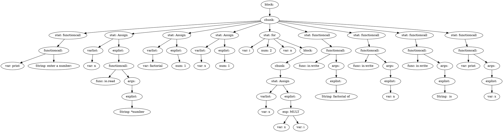

```graphviz
digraph {
65 [label="block: "];
65 -> 4
4 [label="chunk: "];
4 -> 3
4 -> 14
4 -> 19
4 -> 24
4 -> 36
4 -> 44
4 -> 51
4 -> 58
4 -> 64
3 [label="stat: functioncall"];
3 -> 2
2 [label="functioncall: "];
2 -> 0
2 -> 1
0 [label="var: print"];
1 [label="String: enter a number:"];
14 [label="stat: Assign"];
14 -> 6
14 -> 13
6 [label="varlist: "];
6 -> 5
5 [label="var: n"];
13 [label="explist: "];
13 -> 12
12 [label="functioncall: "];
12 -> 8
12 -> 11
8 [label="func: io.read"];
11 [label="args: "];
11 -> 10
10 [label="explist: "];
10 -> 9
9 [label="String: *number"];
19 [label="stat: Assign"];
19 -> 16
19 -> 18
16 [label="varlist: "];
16 -> 15
15 [label="var: factorial"];
18 [label="explist: "];
18 -> 17
17 [label="num: 1"];
24 [label="stat: Assign"];
24 -> 21
24 -> 23
21 [label="varlist: "];
21 -> 20
20 [label="var: x"];
23 [label="explist: "];
23 -> 22
22 [label="num: 1"];
36 [label="stat: for"];
36 -> 37
36 -> 25
36 -> 26
36 -> 35
37 [label="var: i"];
25 [label="num: 2"];
26 [label="var: n"];
35 [label="block: "];
35 -> 34
34 [label="chunk: "];
34 -> 33
33 [label="stat: Assign"];
33 -> 28
33 -> 32
28 [label="varlist: "];
28 -> 27
27 [label="var: x"];
32 [label="explist: "];
32 -> 31
31 [label="exp: MULT"];
31 -> 29
31 -> 30
29 [label="var: x"];
30 [label="var: i"];
44 [label="stat: functioncall"];
44 -> 43
43 [label="functioncall: "];
43 -> 39
43 -> 42
39 [label="func: io.write"];
42 [label="args: "];
42 -> 41
41 [label="explist: "];
41 -> 40
40 [label="String: factorial of "];
51 [label="stat: functioncall"];
51 -> 50
50 [label="functioncall: "];
50 -> 46
50 -> 49
46 [label="func: io.write"];
49 [label="args: "];
49 -> 48
48 [label="explist: "];
48 -> 47
47 [label="var: n"];
58 [label="stat: functioncall"];
58 -> 57
57 [label="functioncall: "];
57 -> 53
57 -> 56
53 [label="func: io.write"];
56 [label="args: "];
56 -> 55
55 [label="explist: "];
55 -> 54
54 [label="String:  is "];
64 [label="stat: functioncall"];
64 -> 63
63 [label="functioncall: "];
63 -> 59
63 -> 62
59 [label="var: print"];
62 [label="args: "];
62 -> 61
61 [label="explist: "];
61 -> 60
60 [label="var: x"];
}
```