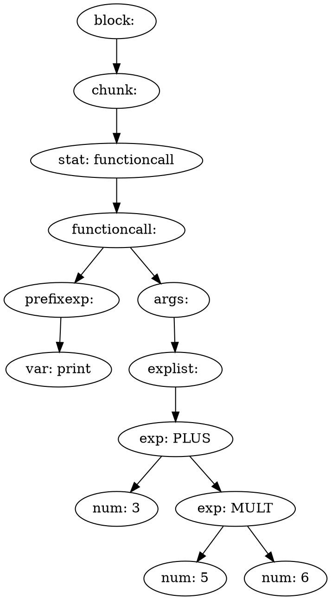

```graphviz
digraph {
12 [label="block: "];
12 -> 11
11 [label="chunk: "];
11 -> 10
10 [label="stat: functioncall"];
10 -> 9
9 [label="functioncall: "];
9 -> 1
9 -> 8
1 [label="prefixexp: "];
1 -> 0
0 [label="var: print"];
8 [label="args: "];
8 -> 7
7 [label="explist: "];
7 -> 6
6 [label="exp: PLUS"];
6 -> 2
6 -> 5
2 [label="num: 3"];
5 [label="exp: MULT"];
5 -> 3
5 -> 4
3 [label="num: 5"];
4 [label="num: 6"];
}
```