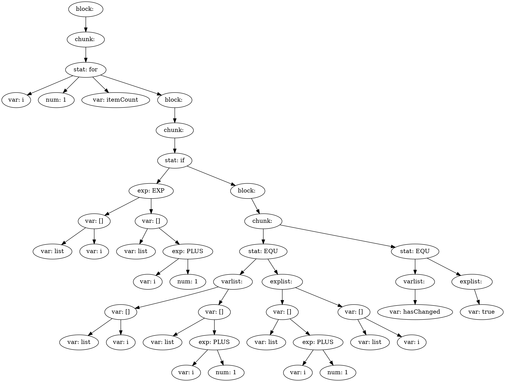

```graphviz
digraph {
43 [label="block: "];
43 -> 42
42 [label="chunk: "];
42 -> 40
40 [label="stat: for"];
40 -> 41
40 -> 0
40 -> 1
40 -> 39
41 [label="var: i"];
0 [label="num: 1"];
1 [label="var: itemCount"];
39 [label="block: "];
39 -> 38
38 [label="chunk: "];
38 -> 37
37 [label="stat: if"];
37 -> 10
37 -> 36
10 [label="exp: EXP"];
10 -> 4
10 -> 9
4 [label="var: []"];
4 -> 2
4 -> 3
2 [label="var: list"];
3 [label="var: i"];
9 [label="var: []"];
9 -> 5
9 -> 8
5 [label="var: list"];
8 [label="exp: PLUS"];
8 -> 6
8 -> 7
6 [label="var: i"];
7 [label="num: 1"];
36 [label="block: "];
36 -> 30
30 [label="chunk: "];
30 -> 29
30 -> 35
29 [label="stat: EQU"];
29 -> 14
29 -> 25
14 [label="varlist: "];
14 -> 13
14 -> 19
13 [label="var: []"];
13 -> 11
13 -> 12
11 [label="var: list"];
12 [label="var: i"];
19 [label="var: []"];
19 -> 15
19 -> 18
15 [label="var: list"];
18 [label="exp: PLUS"];
18 -> 16
18 -> 17
16 [label="var: i"];
17 [label="num: 1"];
25 [label="explist: "];
25 -> 24
25 -> 28
24 [label="var: []"];
24 -> 20
24 -> 23
20 [label="var: list"];
23 [label="exp: PLUS"];
23 -> 21
23 -> 22
21 [label="var: i"];
22 [label="num: 1"];
28 [label="var: []"];
28 -> 26
28 -> 27
26 [label="var: list"];
27 [label="var: i"];
35 [label="stat: EQU"];
35 -> 32
35 -> 34
32 [label="varlist: "];
32 -> 31
31 [label="var: hasChanged"];
34 [label="explist: "];
34 -> 33
33 [label="var: true"];
}
```