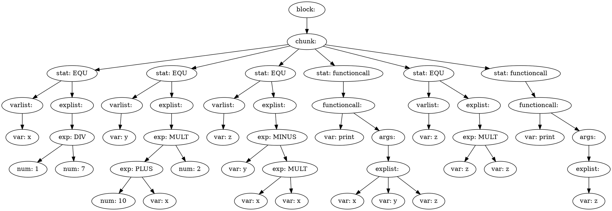

```graphviz
digraph {
47 [label="block: "];
47 -> 7
7 [label="chunk: "];
7 -> 6
7 -> 16
7 -> 25
7 -> 33
7 -> 40
7 -> 46
6 [label="stat: EQU"];
6 -> 1
6 -> 5
1 [label="varlist: "];
1 -> 0
0 [label="var: x"];
5 [label="explist: "];
5 -> 4
4 [label="exp: DIV"];
4 -> 2
4 -> 3
2 [label="num: 1"];
3 [label="num: 7"];
16 [label="stat: EQU"];
16 -> 9
16 -> 15
9 [label="varlist: "];
9 -> 8
8 [label="var: y"];
15 [label="explist: "];
15 -> 14
14 [label="exp: MULT"];
14 -> 12
14 -> 13
12 [label="exp: PLUS"];
12 -> 10
12 -> 11
10 [label="num: 10"];
11 [label="var: x"];
13 [label="num: 2"];
25 [label="stat: EQU"];
25 -> 18
25 -> 24
18 [label="varlist: "];
18 -> 17
17 [label="var: z"];
24 [label="explist: "];
24 -> 23
23 [label="exp: MINUS"];
23 -> 19
23 -> 22
19 [label="var: y"];
22 [label="exp: MULT"];
22 -> 20
22 -> 21
20 [label="var: x"];
21 [label="var: x"];
33 [label="stat: functioncall"];
33 -> 32
32 [label="functioncall: "];
32 -> 26
32 -> 31
26 [label="var: print"];
31 [label="args: "];
31 -> 28
28 [label="explist: "];
28 -> 27
28 -> 29
28 -> 30
27 [label="var: x"];
29 [label="var: y"];
30 [label="var: z"];
40 [label="stat: EQU"];
40 -> 35
40 -> 39
35 [label="varlist: "];
35 -> 34
34 [label="var: z"];
39 [label="explist: "];
39 -> 38
38 [label="exp: MULT"];
38 -> 36
38 -> 37
36 [label="var: z"];
37 [label="var: z"];
46 [label="stat: functioncall"];
46 -> 45
45 [label="functioncall: "];
45 -> 41
45 -> 44
41 [label="var: print"];
44 [label="args: "];
44 -> 43
43 [label="explist: "];
43 -> 42
42 [label="var: z"];
}
```