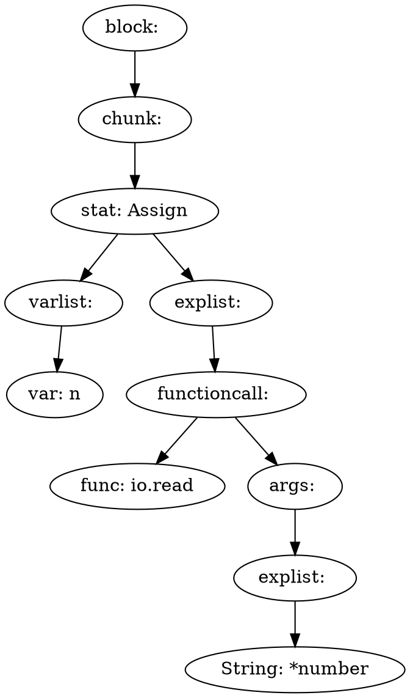

```graphviz
digraph {
11 [label="block: "];
11 -> 10
10 [label="chunk: "];
10 -> 9
9 [label="stat: Assign"];
9 -> 1
9 -> 8
1 [label="varlist: "];
1 -> 0
0 [label="var: n"];
8 [label="explist: "];
8 -> 7
7 [label="functioncall: "];
7 -> 3
7 -> 6
3 [label="func: io.read"];
6 [label="args: "];
6 -> 5
5 [label="explist: "];
5 -> 4
4 [label="String: *number"];
}
```