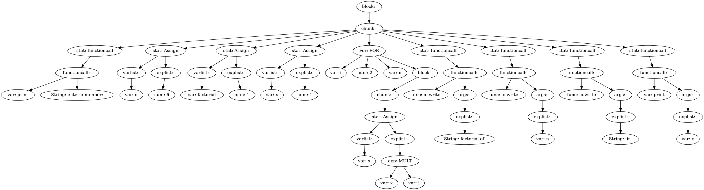

```graphviz
digraph {
60 [label="block: "];
60 -> 4
4 [label="chunk: "];
4 -> 3
4 -> 9
4 -> 14
4 -> 19
4 -> 32
4 -> 39
4 -> 46
4 -> 53
4 -> 59
3 [label="stat: functioncall"];
3 -> 2
2 [label="functioncall: "];
2 -> 0
2 -> 1
0 [label="var: print"];
1 [label="String: enter a number:"];
9 [label="stat: Assign"];
9 -> 6
9 -> 8
6 [label="varlist: "];
6 -> 5
5 [label="var: n"];
8 [label="explist: "];
8 -> 7
7 [label="num: 6"];
14 [label="stat: Assign"];
14 -> 11
14 -> 13
11 [label="varlist: "];
11 -> 10
10 [label="var: factorial"];
13 [label="explist: "];
13 -> 12
12 [label="num: 1"];
19 [label="stat: Assign"];
19 -> 16
19 -> 18
16 [label="varlist: "];
16 -> 15
15 [label="var: x"];
18 [label="explist: "];
18 -> 17
17 [label="num: 1"];
32 [label="For: FOR"];
32 -> 31
32 -> 20
32 -> 21
32 -> 30
31 [label="var: i"];
20 [label="num: 2"];
21 [label="var: n"];
30 [label="block: "];
30 -> 29
29 [label="chunk: "];
29 -> 28
28 [label="stat: Assign"];
28 -> 23
28 -> 27
23 [label="varlist: "];
23 -> 22
22 [label="var: x"];
27 [label="explist: "];
27 -> 26
26 [label="exp: MULT"];
26 -> 24
26 -> 25
24 [label="var: x"];
25 [label="var: i"];
39 [label="stat: functioncall"];
39 -> 38
38 [label="functioncall: "];
38 -> 34
38 -> 37
34 [label="func: io.write"];
37 [label="args: "];
37 -> 36
36 [label="explist: "];
36 -> 35
35 [label="String: factorial of "];
46 [label="stat: functioncall"];
46 -> 45
45 [label="functioncall: "];
45 -> 41
45 -> 44
41 [label="func: io.write"];
44 [label="args: "];
44 -> 43
43 [label="explist: "];
43 -> 42
42 [label="var: n"];
53 [label="stat: functioncall"];
53 -> 52
52 [label="functioncall: "];
52 -> 48
52 -> 51
48 [label="func: io.write"];
51 [label="args: "];
51 -> 50
50 [label="explist: "];
50 -> 49
49 [label="String:  is "];
59 [label="stat: functioncall"];
59 -> 58
58 [label="functioncall: "];
58 -> 54
58 -> 57
54 [label="var: print"];
57 [label="args: "];
57 -> 56
56 [label="explist: "];
56 -> 55
55 [label="var: x"];
}
```