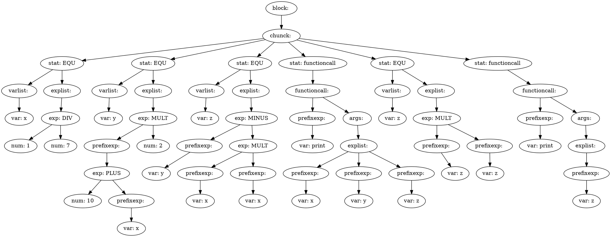

```graphviz
digraph {
60 [label="block: "];
60 -> 7
7 [label="chunck: "];
7 -> 6
7 -> 18
7 -> 30
7 -> 42
7 -> 51
7 -> 59
6 [label="stat: EQU"];
6 -> 1
6 -> 5
1 [label="varlist: "];
1 -> 0
0 [label="var: x"];
5 [label="explist: "];
5 -> 4
4 [label="exp: DIV"];
4 -> 2
4 -> 3
2 [label="num: 1"];
3 [label="num: 7"];
18 [label="stat: EQU"];
18 -> 9
18 -> 17
9 [label="varlist: "];
9 -> 8
8 [label="var: y"];
17 [label="explist: "];
17 -> 16
16 [label="exp: MULT"];
16 -> 14
16 -> 15
14 [label="prefixexp: "];
14 -> 13
13 [label="exp: PLUS"];
13 -> 10
13 -> 12
10 [label="num: 10"];
12 [label="prefixexp: "];
12 -> 11
11 [label="var: x"];
15 [label="num: 2"];
30 [label="stat: EQU"];
30 -> 20
30 -> 29
20 [label="varlist: "];
20 -> 19
19 [label="var: z"];
29 [label="explist: "];
29 -> 28
28 [label="exp: MINUS"];
28 -> 22
28 -> 27
22 [label="prefixexp: "];
22 -> 21
21 [label="var: y"];
27 [label="exp: MULT"];
27 -> 24
27 -> 26
24 [label="prefixexp: "];
24 -> 23
23 [label="var: x"];
26 [label="prefixexp: "];
26 -> 25
25 [label="var: x"];
42 [label="stat: functioncall"];
42 -> 41
41 [label="functioncall: "];
41 -> 32
41 -> 40
32 [label="prefixexp: "];
32 -> 31
31 [label="var: print"];
40 [label="args: "];
40 -> 35
35 [label="explist: "];
35 -> 34
35 -> 37
35 -> 39
34 [label="prefixexp: "];
34 -> 33
33 [label="var: x"];
37 [label="prefixexp: "];
37 -> 36
36 [label="var: y"];
39 [label="prefixexp: "];
39 -> 38
38 [label="var: z"];
51 [label="stat: EQU"];
51 -> 44
51 -> 50
44 [label="varlist: "];
44 -> 43
43 [label="var: z"];
50 [label="explist: "];
50 -> 49
49 [label="exp: MULT"];
49 -> 46
49 -> 48
46 [label="prefixexp: "];
46 -> 45
45 [label="var: z"];
48 [label="prefixexp: "];
48 -> 47
47 [label="var: z"];
59 [label="stat: functioncall"];
59 -> 58
58 [label="functioncall: "];
58 -> 53
58 -> 57
53 [label="prefixexp: "];
53 -> 52
52 [label="var: print"];
57 [label="args: "];
57 -> 56
56 [label="explist: "];
56 -> 55
55 [label="prefixexp: "];
55 -> 54
54 [label="var: z"];
}
```