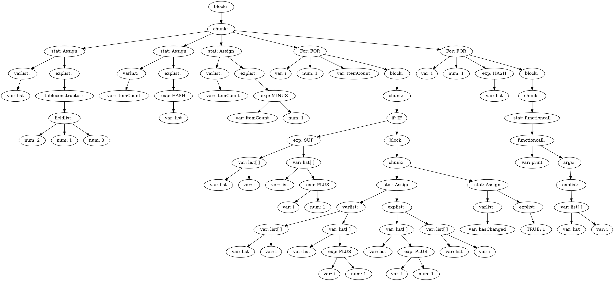

```graphviz
digraph {
80 [label="block: "];
80 -> 9
9 [label="chunk: "];
9 -> 8
9 -> 15
9 -> 22
9 -> 64
9 -> 79
8 [label="stat: Assign"];
8 -> 1
8 -> 7
1 [label="varlist: "];
1 -> 0
0 [label="var: list"];
7 [label="explist: "];
7 -> 6
6 [label="tableconstructor: "];
6 -> 3
3 [label="fieldlist: "];
3 -> 2
3 -> 4
3 -> 5
2 [label="num: 2"];
4 [label="num: 1"];
5 [label="num: 3"];
15 [label="stat: Assign"];
15 -> 11
15 -> 14
11 [label="varlist: "];
11 -> 10
10 [label="var: itemCount"];
14 [label="explist: "];
14 -> 13
13 [label="exp: HASH"];
13 -> 12
12 [label="var: list"];
22 [label="stat: Assign"];
22 -> 17
22 -> 21
17 [label="varlist: "];
17 -> 16
16 [label="var: itemCount"];
21 [label="explist: "];
21 -> 20
20 [label="exp: MINUS"];
20 -> 18
20 -> 19
18 [label="var: itemCount"];
19 [label="num: 1"];
64 [label="For: FOR"];
64 -> 63
64 -> 23
64 -> 24
64 -> 62
63 [label="var: i"];
23 [label="num: 1"];
24 [label="var: itemCount"];
62 [label="block: "];
62 -> 61
61 [label="chunk: "];
61 -> 60
60 [label="if: IF"];
60 -> 33
60 -> 59
33 [label="exp: SUP"];
33 -> 27
33 -> 32
27 [label="var: list[ ]"];
27 -> 25
27 -> 26
25 [label="var: list"];
26 [label="var: i"];
32 [label="var: list[ ]"];
32 -> 28
32 -> 31
28 [label="var: list"];
31 [label="exp: PLUS"];
31 -> 29
31 -> 30
29 [label="var: i"];
30 [label="num: 1"];
59 [label="block: "];
59 -> 53
53 [label="chunk: "];
53 -> 52
53 -> 58
52 [label="stat: Assign"];
52 -> 37
52 -> 48
37 [label="varlist: "];
37 -> 36
37 -> 42
36 [label="var: list[ ]"];
36 -> 34
36 -> 35
34 [label="var: list"];
35 [label="var: i"];
42 [label="var: list[ ]"];
42 -> 38
42 -> 41
38 [label="var: list"];
41 [label="exp: PLUS"];
41 -> 39
41 -> 40
39 [label="var: i"];
40 [label="num: 1"];
48 [label="explist: "];
48 -> 47
48 -> 51
47 [label="var: list[ ]"];
47 -> 43
47 -> 46
43 [label="var: list"];
46 [label="exp: PLUS"];
46 -> 44
46 -> 45
44 [label="var: i"];
45 [label="num: 1"];
51 [label="var: list[ ]"];
51 -> 49
51 -> 50
49 [label="var: list"];
50 [label="var: i"];
58 [label="stat: Assign"];
58 -> 55
58 -> 57
55 [label="varlist: "];
55 -> 54
54 [label="var: hasChanged"];
57 [label="explist: "];
57 -> 56
56 [label="TRUE: 1"];
79 [label="For: FOR"];
79 -> 78
79 -> 65
79 -> 67
79 -> 77
78 [label="var: i"];
65 [label="num: 1"];
67 [label="exp: HASH"];
67 -> 66
66 [label="var: list"];
77 [label="block: "];
77 -> 76
76 [label="chunk: "];
76 -> 75
75 [label="stat: functioncall"];
75 -> 74
74 [label="functioncall: "];
74 -> 68
74 -> 73
68 [label="var: print"];
73 [label="args: "];
73 -> 72
72 [label="explist: "];
72 -> 71
71 [label="var: list[ ]"];
71 -> 69
71 -> 70
69 [label="var: list"];
70 [label="var: i"];
}
```