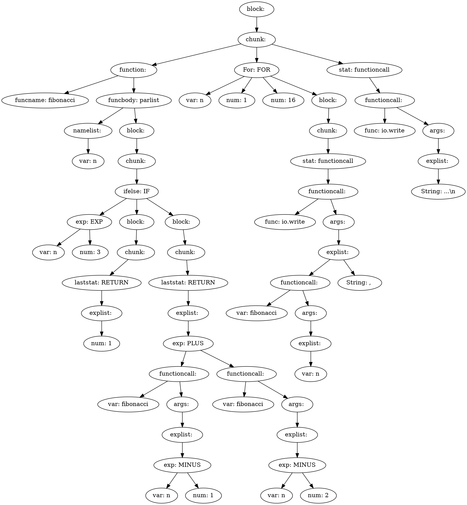

```graphviz
digraph {
61 [label="block: "];
61 -> 35
35 [label="chunk: "];
35 -> 34
35 -> 53
35 -> 60
34 [label="function: "];
34 -> 0
34 -> 33
0 [label="funcname: fibonacci"];
33 [label="funcbody: parlist"];
33 -> 1
33 -> 32
1 [label="namelist: "];
1 -> 2
2 [label="var: n"];
32 [label="block: "];
32 -> 31
31 [label="chunk: "];
31 -> 30
30 [label="ifelse: IF"];
30 -> 5
30 -> 10
30 -> 29
5 [label="exp: EXP"];
5 -> 3
5 -> 4
3 [label="var: n"];
4 [label="num: 3"];
10 [label="block: "];
10 -> 9
9 [label="chunk: "];
9 -> 8
8 [label="laststat: RETURN"];
8 -> 7
7 [label="explist: "];
7 -> 6
6 [label="num: 1"];
29 [label="block: "];
29 -> 28
28 [label="chunk: "];
28 -> 27
27 [label="laststat: RETURN"];
27 -> 26
26 [label="explist: "];
26 -> 25
25 [label="exp: PLUS"];
25 -> 17
25 -> 24
17 [label="functioncall: "];
17 -> 11
17 -> 16
11 [label="var: fibonacci"];
16 [label="args: "];
16 -> 15
15 [label="explist: "];
15 -> 14
14 [label="exp: MINUS"];
14 -> 12
14 -> 13
12 [label="var: n"];
13 [label="num: 1"];
24 [label="functioncall: "];
24 -> 18
24 -> 23
18 [label="var: fibonacci"];
23 [label="args: "];
23 -> 22
22 [label="explist: "];
22 -> 21
21 [label="exp: MINUS"];
21 -> 19
21 -> 20
19 [label="var: n"];
20 [label="num: 2"];
53 [label="For: FOR"];
53 -> 52
53 -> 36
53 -> 37
53 -> 51
52 [label="var: n"];
36 [label="num: 1"];
37 [label="num: 16"];
51 [label="block: "];
51 -> 50
50 [label="chunk: "];
50 -> 49
49 [label="stat: functioncall"];
49 -> 48
48 [label="functioncall: "];
48 -> 39
48 -> 47
39 [label="func: io.write"];
47 [label="args: "];
47 -> 45
45 [label="explist: "];
45 -> 44
45 -> 46
44 [label="functioncall: "];
44 -> 40
44 -> 43
40 [label="var: fibonacci"];
43 [label="args: "];
43 -> 42
42 [label="explist: "];
42 -> 41
41 [label="var: n"];
46 [label="String: , "];
60 [label="stat: functioncall"];
60 -> 59
59 [label="functioncall: "];
59 -> 55
59 -> 58
55 [label="func: io.write"];
58 [label="args: "];
58 -> 57
57 [label="explist: "];
57 -> 56
56 [label="String: ...\\n"];
}
```