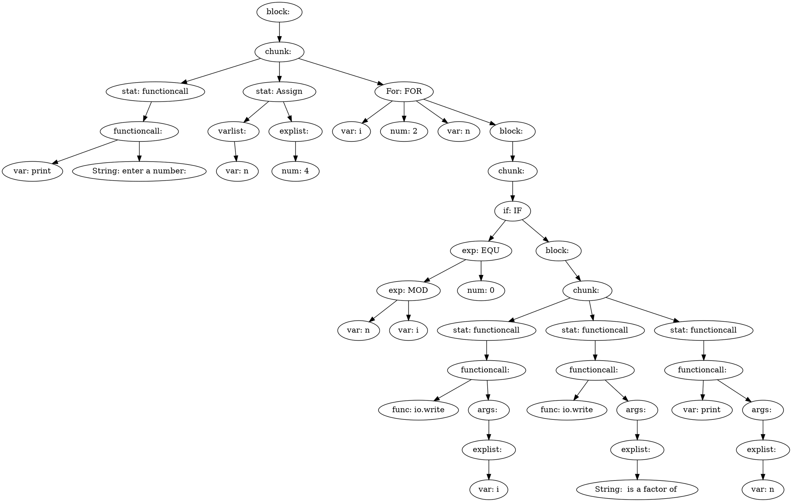

```graphviz
digraph {
44 [label="block: "];
44 -> 4
4 [label="chunk: "];
4 -> 3
4 -> 9
4 -> 43
3 [label="stat: functioncall"];
3 -> 2
2 [label="functioncall: "];
2 -> 0
2 -> 1
0 [label="var: print"];
1 [label="String: enter a number:"];
9 [label="stat: Assign"];
9 -> 6
9 -> 8
6 [label="varlist: "];
6 -> 5
5 [label="var: n"];
8 [label="explist: "];
8 -> 7
7 [label="num: 4"];
43 [label="For: FOR"];
43 -> 42
43 -> 10
43 -> 11
43 -> 41
42 [label="var: i"];
10 [label="num: 2"];
11 [label="var: n"];
41 [label="block: "];
41 -> 40
40 [label="chunk: "];
40 -> 39
39 [label="if: IF"];
39 -> 16
39 -> 38
16 [label="exp: EQU"];
16 -> 14
16 -> 15
14 [label="exp: MOD"];
14 -> 12
14 -> 13
12 [label="var: n"];
13 [label="var: i"];
15 [label="num: 0"];
38 [label="block: "];
38 -> 24
24 [label="chunk: "];
24 -> 23
24 -> 31
24 -> 37
23 [label="stat: functioncall"];
23 -> 22
22 [label="functioncall: "];
22 -> 18
22 -> 21
18 [label="func: io.write"];
21 [label="args: "];
21 -> 20
20 [label="explist: "];
20 -> 19
19 [label="var: i"];
31 [label="stat: functioncall"];
31 -> 30
30 [label="functioncall: "];
30 -> 26
30 -> 29
26 [label="func: io.write"];
29 [label="args: "];
29 -> 28
28 [label="explist: "];
28 -> 27
27 [label="String:  is a factor of "];
37 [label="stat: functioncall"];
37 -> 36
36 [label="functioncall: "];
36 -> 32
36 -> 35
32 [label="var: print"];
35 [label="args: "];
35 -> 34
34 [label="explist: "];
34 -> 33
33 [label="var: n"];
}
```