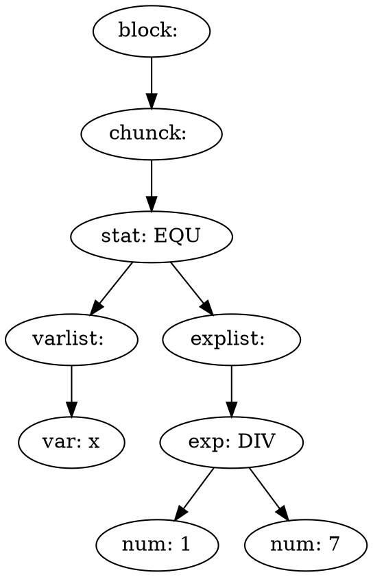

```graphviz
digraph {
8 [label="block: "];
8 -> 7
7 [label="chunck: "];
7 -> 6
6 [label="stat: EQU"];
6 -> 1
6 -> 5
1 [label="varlist: "];
1 -> 0
0 [label="var: x"];
5 [label="explist: "];
5 -> 4
4 [label="exp: DIV"];
4 -> 2
4 -> 3
2 [label="num: 1"];
3 [label="num: 7"];
}
```