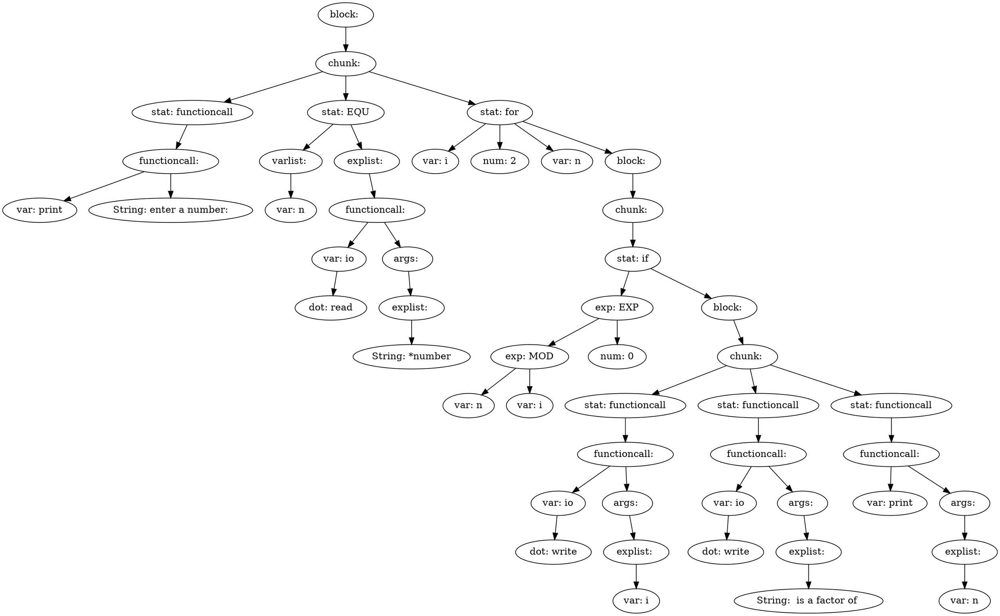

```graphviz
digraph {
49 [label="block: "];
49 -> 4
4 [label="chunk: "];
4 -> 3
4 -> 14
4 -> 47
3 [label="stat: functioncall"];
3 -> 2
2 [label="functioncall: "];
2 -> 0
2 -> 1
0 [label="var: print"];
1 [label="String: enter a number:"];
14 [label="stat: EQU"];
14 -> 6
14 -> 13
6 [label="varlist: "];
6 -> 5
5 [label="var: n"];
13 [label="explist: "];
13 -> 12
12 [label="functioncall: "];
12 -> 7
12 -> 11
7 [label="var: io"];
7 -> 8
8 [label="dot: read"];
11 [label="args: "];
11 -> 10
10 [label="explist: "];
10 -> 9
9 [label="String: *number"];
47 [label="stat: for"];
47 -> 48
47 -> 15
47 -> 16
47 -> 46
48 [label="var: i"];
15 [label="num: 2"];
16 [label="var: n"];
46 [label="block: "];
46 -> 45
45 [label="chunk: "];
45 -> 44
44 [label="stat: if"];
44 -> 21
44 -> 43
21 [label="exp: EXP"];
21 -> 19
21 -> 20
19 [label="exp: MOD"];
19 -> 17
19 -> 18
17 [label="var: n"];
18 [label="var: i"];
20 [label="num: 0"];
43 [label="block: "];
43 -> 29
29 [label="chunk: "];
29 -> 28
29 -> 36
29 -> 42
28 [label="stat: functioncall"];
28 -> 27
27 [label="functioncall: "];
27 -> 22
27 -> 26
22 [label="var: io"];
22 -> 23
23 [label="dot: write"];
26 [label="args: "];
26 -> 25
25 [label="explist: "];
25 -> 24
24 [label="var: i"];
36 [label="stat: functioncall"];
36 -> 35
35 [label="functioncall: "];
35 -> 30
35 -> 34
30 [label="var: io"];
30 -> 31
31 [label="dot: write"];
34 [label="args: "];
34 -> 33
33 [label="explist: "];
33 -> 32
32 [label="String:  is a factor of "];
42 [label="stat: functioncall"];
42 -> 41
41 [label="functioncall: "];
41 -> 37
41 -> 40
37 [label="var: print"];
40 [label="args: "];
40 -> 39
39 [label="explist: "];
39 -> 38
38 [label="var: n"];
}
```