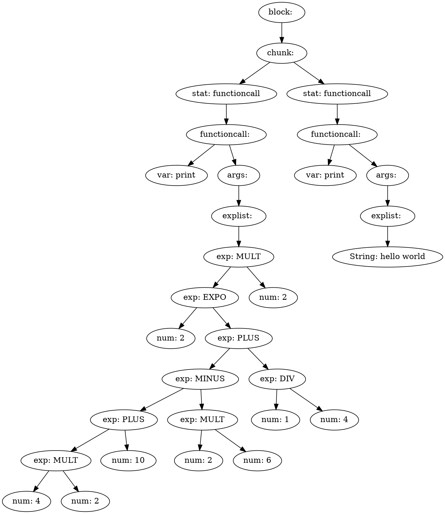

```graphviz
digraph {
29 [label="block: "];
29 -> 22
22 [label="chunk: "];
22 -> 21
22 -> 28
21 [label="stat: functioncall"];
21 -> 20
20 [label="functioncall: "];
20 -> 0
20 -> 19
0 [label="var: print"];
19 [label="args: "];
19 -> 18
18 [label="explist: "];
18 -> 17
17 [label="exp: MULT"];
17 -> 15
17 -> 16
15 [label="exp: EXPO"];
15 -> 1
15 -> 14
1 [label="num: 2"];
14 [label="exp: PLUS"];
14 -> 10
14 -> 13
10 [label="exp: MINUS"];
10 -> 6
10 -> 9
6 [label="exp: PLUS"];
6 -> 4
6 -> 5
4 [label="exp: MULT"];
4 -> 2
4 -> 3
2 [label="num: 4"];
3 [label="num: 2"];
5 [label="num: 10"];
9 [label="exp: MULT"];
9 -> 7
9 -> 8
7 [label="num: 2"];
8 [label="num: 6"];
13 [label="exp: DIV"];
13 -> 11
13 -> 12
11 [label="num: 1"];
12 [label="num: 4"];
16 [label="num: 2"];
28 [label="stat: functioncall"];
28 -> 27
27 [label="functioncall: "];
27 -> 23
27 -> 26
23 [label="var: print"];
26 [label="args: "];
26 -> 25
25 [label="explist: "];
25 -> 24
24 [label="String: hello world"];
}
```