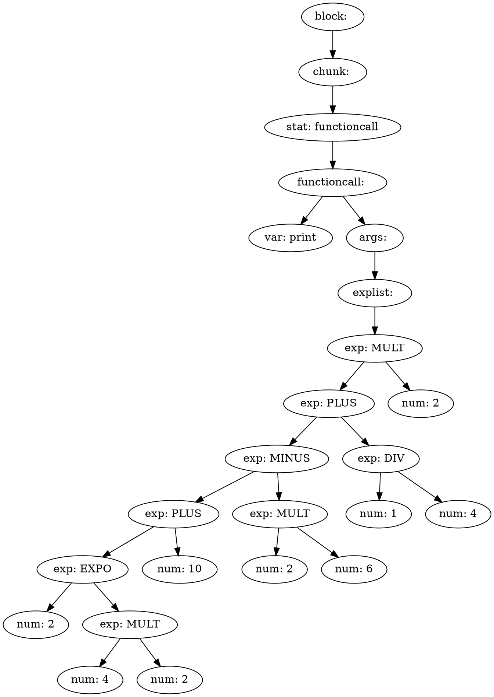

```graphviz
digraph {
23 [label="block: "];
23 -> 22
22 [label="chunk: "];
22 -> 21
21 [label="stat: functioncall"];
21 -> 20
20 [label="functioncall: "];
20 -> 0
20 -> 19
0 [label="var: print"];
19 [label="args: "];
19 -> 18
18 [label="explist: "];
18 -> 17
17 [label="exp: MULT"];
17 -> 15
17 -> 16
15 [label="exp: PLUS"];
15 -> 11
15 -> 14
11 [label="exp: MINUS"];
11 -> 7
11 -> 10
7 [label="exp: PLUS"];
7 -> 5
7 -> 6
5 [label="exp: EXPO"];
5 -> 1
5 -> 4
1 [label="num: 2"];
4 [label="exp: MULT"];
4 -> 2
4 -> 3
2 [label="num: 4"];
3 [label="num: 2"];
6 [label="num: 10"];
10 [label="exp: MULT"];
10 -> 8
10 -> 9
8 [label="num: 2"];
9 [label="num: 6"];
14 [label="exp: DIV"];
14 -> 12
14 -> 13
12 [label="num: 1"];
13 [label="num: 4"];
16 [label="num: 2"];
}
```