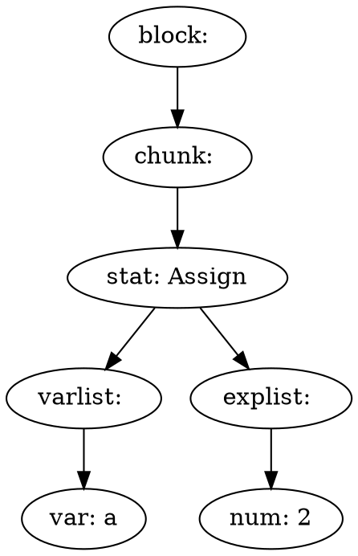

```graphviz
digraph {
6 [label="block: "];
6 -> 5
5 [label="chunk: "];
5 -> 4
4 [label="stat: Assign"];
4 -> 1
4 -> 3
1 [label="varlist: "];
1 -> 0
0 [label="var: a"];
3 [label="explist: "];
3 -> 2
2 [label="num: 2"];
}
```