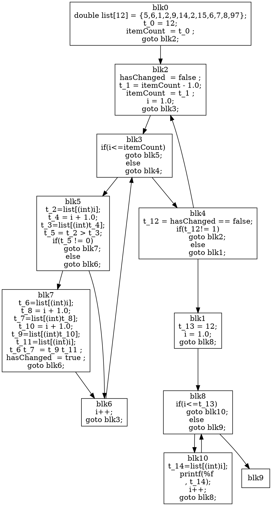

```graphviz
digraph {
node [shape=box];
BB0x55be9e46e2a0 [label="blk0
double list[12] = {5,6,1,2,9,14,2,15,6,7,8,97};
t_0 = 12;
itemCount  = t_0 ;
goto blk2;
"];
BB0x55be9e46e2a0 -> BB0x55be9e46e9b0
BB0x55be9e46e9b0 [label="blk2
hasChanged  = false ;
t_1 = itemCount - 1.0;
itemCount  = t_1 ;
i = 1.0;
goto blk3;
"];
BB0x55be9e46e9b0 -> BB0x55be9e46ec70
BB0x55be9e46ec70 [label="blk3
if(i<=itemCount) 
	goto blk5;
else 
	goto blk4;
"];
BB0x55be9e46ec70 -> BB0x55be9e46edd0
BB0x55be9e46ec70 -> BB0x55be9e46ed60
BB0x55be9e46ed60 [label="blk4
t_12 = hasChanged == false;
if(t_12!= 1)
	goto blk2;
else
	goto blk1;
"];
BB0x55be9e46ed60 -> BB0x55be9e46e9b0
BB0x55be9e46ed60 -> BB0x55be9e46e940
BB0x55be9e46e940 [label="blk1
t_13 = 12;
i = 1.0;
goto blk8;
"];
BB0x55be9e46e940 -> BB0x55be9e46fae0
BB0x55be9e46edd0 [label="blk5
t_2=list[(int)i];
t_4 = i + 1.0;
t_3=list[(int)t_4];
t_5 = t_2 > t_3;
if(t_5 != 0)
	goto blk7;
else
	goto blk6;
"];
BB0x55be9e46edd0 -> BB0x55be9e46ef70
BB0x55be9e46edd0 -> BB0x55be9e46ef00
BB0x55be9e46ef00 [label="blk6
i++;
goto blk3;
"];
BB0x55be9e46ef00 -> BB0x55be9e46ec70
BB0x55be9e46ef70 [label="blk7
t_6=list[(int)i];
t_8 = i + 1.0;
t_7=list[(int)t_8];
t_10 = i + 1.0;
t_9=list[(int)t_10];
t_11=list[(int)i];
t_6 t_7  = t_9 t_11 ;
hasChanged  = true ;
goto blk6;
"];
BB0x55be9e46ef70 -> BB0x55be9e46ef00
BB0x55be9e46fae0 [label="blk8
if(i<=t_13) 
	goto blk10;
else 
	goto blk9;
"];
BB0x55be9e46fae0 -> BB0x55be9e46fc40
BB0x55be9e46fae0 -> BB0x55be9e46fbd0
BB0x55be9e46fbd0 [label="blk9
"];
BB0x55be9e46fc40 [label="blk10
t_14=list[(int)i];
printf(%f \n, t_14);
i++;
goto blk8;
"];
BB0x55be9e46fc40 -> BB0x55be9e46fae0
}
```