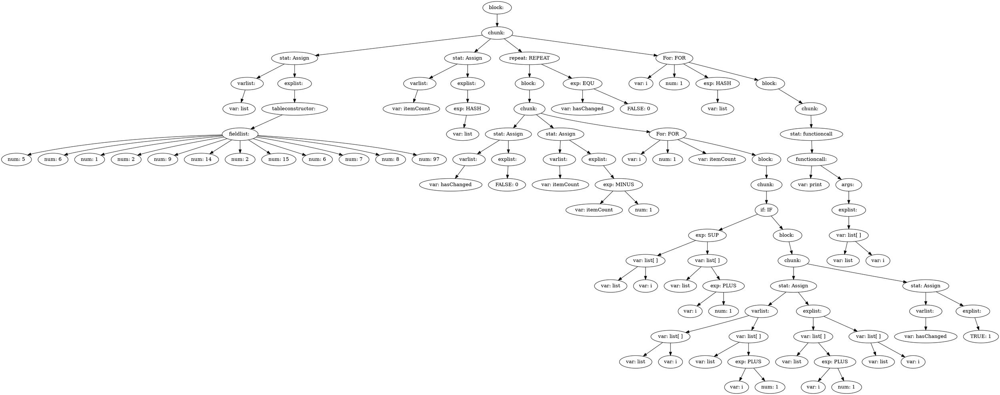

```graphviz
digraph {
100 [label="block: "];
100 -> 18
18 [label="chunk: "];
18 -> 17
18 -> 24
18 -> 84
18 -> 99
17 [label="stat: Assign"];
17 -> 1
17 -> 16
1 [label="varlist: "];
1 -> 0
0 [label="var: list"];
16 [label="explist: "];
16 -> 15
15 [label="tableconstructor: "];
15 -> 3
3 [label="fieldlist: "];
3 -> 2
3 -> 4
3 -> 5
3 -> 6
3 -> 7
3 -> 8
3 -> 9
3 -> 10
3 -> 11
3 -> 12
3 -> 13
3 -> 14
2 [label="num: 5"];
4 [label="num: 6"];
5 [label="num: 1"];
6 [label="num: 2"];
7 [label="num: 9"];
8 [label="num: 14"];
9 [label="num: 2"];
10 [label="num: 15"];
11 [label="num: 6"];
12 [label="num: 7"];
13 [label="num: 8"];
14 [label="num: 97"];
24 [label="stat: Assign"];
24 -> 20
24 -> 23
20 [label="varlist: "];
20 -> 19
19 [label="var: itemCount"];
23 [label="explist: "];
23 -> 22
22 [label="exp: HASH"];
22 -> 21
21 [label="var: list"];
84 [label="repeat: REPEAT"];
84 -> 80
84 -> 83
80 [label="block: "];
80 -> 30
30 [label="chunk: "];
30 -> 29
30 -> 37
30 -> 79
29 [label="stat: Assign"];
29 -> 26
29 -> 28
26 [label="varlist: "];
26 -> 25
25 [label="var: hasChanged"];
28 [label="explist: "];
28 -> 27
27 [label="FALSE: 0"];
37 [label="stat: Assign"];
37 -> 32
37 -> 36
32 [label="varlist: "];
32 -> 31
31 [label="var: itemCount"];
36 [label="explist: "];
36 -> 35
35 [label="exp: MINUS"];
35 -> 33
35 -> 34
33 [label="var: itemCount"];
34 [label="num: 1"];
79 [label="For: FOR"];
79 -> 78
79 -> 38
79 -> 39
79 -> 77
78 [label="var: i"];
38 [label="num: 1"];
39 [label="var: itemCount"];
77 [label="block: "];
77 -> 76
76 [label="chunk: "];
76 -> 75
75 [label="if: IF"];
75 -> 48
75 -> 74
48 [label="exp: SUP"];
48 -> 42
48 -> 47
42 [label="var: list[ ]"];
42 -> 40
42 -> 41
40 [label="var: list"];
41 [label="var: i"];
47 [label="var: list[ ]"];
47 -> 43
47 -> 46
43 [label="var: list"];
46 [label="exp: PLUS"];
46 -> 44
46 -> 45
44 [label="var: i"];
45 [label="num: 1"];
74 [label="block: "];
74 -> 68
68 [label="chunk: "];
68 -> 67
68 -> 73
67 [label="stat: Assign"];
67 -> 52
67 -> 63
52 [label="varlist: "];
52 -> 51
52 -> 57
51 [label="var: list[ ]"];
51 -> 49
51 -> 50
49 [label="var: list"];
50 [label="var: i"];
57 [label="var: list[ ]"];
57 -> 53
57 -> 56
53 [label="var: list"];
56 [label="exp: PLUS"];
56 -> 54
56 -> 55
54 [label="var: i"];
55 [label="num: 1"];
63 [label="explist: "];
63 -> 62
63 -> 66
62 [label="var: list[ ]"];
62 -> 58
62 -> 61
58 [label="var: list"];
61 [label="exp: PLUS"];
61 -> 59
61 -> 60
59 [label="var: i"];
60 [label="num: 1"];
66 [label="var: list[ ]"];
66 -> 64
66 -> 65
64 [label="var: list"];
65 [label="var: i"];
73 [label="stat: Assign"];
73 -> 70
73 -> 72
70 [label="varlist: "];
70 -> 69
69 [label="var: hasChanged"];
72 [label="explist: "];
72 -> 71
71 [label="TRUE: 1"];
83 [label="exp: EQU"];
83 -> 81
83 -> 82
81 [label="var: hasChanged"];
82 [label="FALSE: 0"];
99 [label="For: FOR"];
99 -> 98
99 -> 85
99 -> 87
99 -> 97
98 [label="var: i"];
85 [label="num: 1"];
87 [label="exp: HASH"];
87 -> 86
86 [label="var: list"];
97 [label="block: "];
97 -> 96
96 [label="chunk: "];
96 -> 95
95 [label="stat: functioncall"];
95 -> 94
94 [label="functioncall: "];
94 -> 88
94 -> 93
88 [label="var: print"];
93 [label="args: "];
93 -> 92
92 [label="explist: "];
92 -> 91
91 [label="var: list[ ]"];
91 -> 89
91 -> 90
89 [label="var: list"];
90 [label="var: i"];
}
```